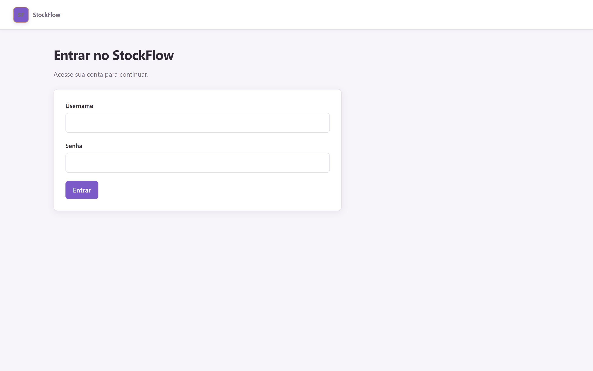
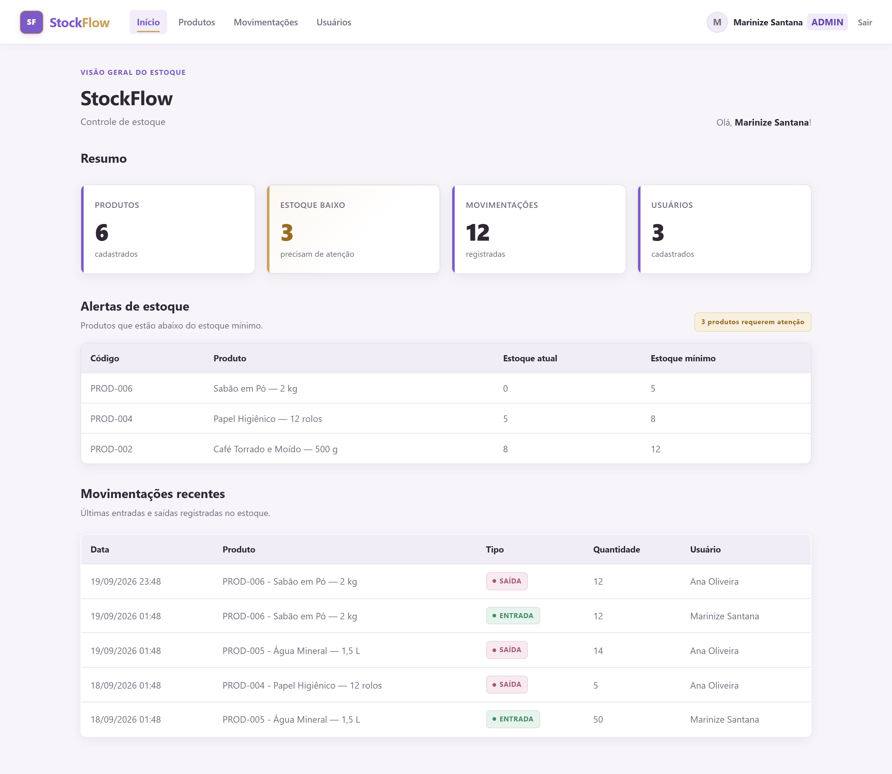
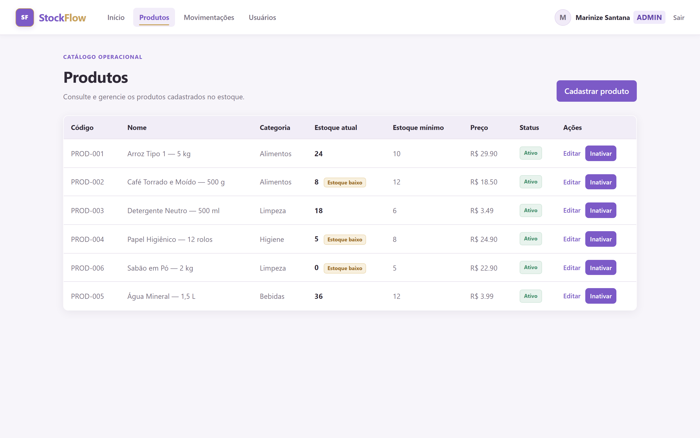
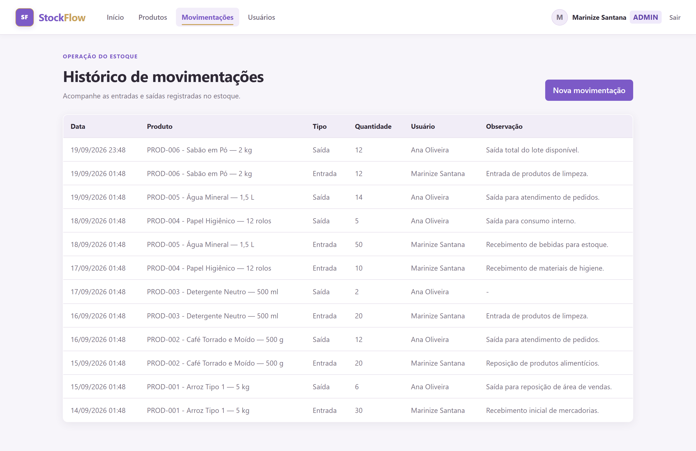

# StockFlow

[](https://github.com/marinizedev/stockflow-inventory-system/actions/workflows/ci.yml)
[](https://github.com/marinizedev/stockflow-inventory-system/actions/workflows/security.yml)
[](https://github.com/marinizedev/stockflow-inventory-system/actions/workflows/cd.yml)

Sistema web de controle de estoque desenvolvido em **Python e Flask**, com autenticação,
autorização por perfil, cadastro de produtos, movimentações de entrada e saída, alertas de
estoque mínimo, testes automatizados e deploy em produção.

O projeto começou como uma aplicação acadêmica local e evoluiu para uma aplicação publicada
na nuvem, utilizando **PostgreSQL no Neon**, **Gunicorn**, **Render** e um pipeline de
**CI/CD com GitHub Actions**.

---

## Índice

- [Demonstração](#demonstração)
  - [Acesso público de demonstração](#acesso-público-de-demonstração)
  - [Demonstração visual](#demonstração-visual)
- [Sobre o projeto](#sobre-o-projeto)
- [Objetivo](#objetivo)
- [Funcionalidades](#funcionalidades)
  - [Autenticação e sessão](#autenticação-e-sessão)
  - [Usuários](#usuários)
  - [Produtos](#produtos)
  - [Movimentações](#movimentações)
  - [Dashboard](#dashboard)
- [Perfis de acesso](#perfis-de-acesso)
- [Regras de negócio](#regras-de-negócio)
- [Arquitetura](#arquitetura)
- [Modelo de dados](#modelo-de-dados)
- [Segurança e integridade](#segurança-e-integridade)
- [Testes automatizados](#testes-automatizados)
- [CI/CD](#cicd)
- [Tecnologias](#tecnologias)
- [Estrutura do projeto](#estrutura-do-projeto)
- [Executar localmente](#executar-localmente)
- [Configuração por ambiente](#configuração-por-ambiente)
  - [Render](#render)
  - [Neon](#neon)
- [Decisões técnicas](#decisões-técnicas)
- [Evolução do projeto](#evolução-do-projeto)
- [Status](#status)
- [Autoria](#autoria)
- [Referências](#referências)
- [Licença](#licença)

---

## Demonstração

**Aplicação publicada:** [acessar o StockFlow](https://stockflow-inventory-system-zaqc.onrender.com)

O serviço gratuito do Render pode ser suspenso após um período de inatividade. Por isso, o primeiro acesso depois de uma pausa pode levar alguns segundos.

### Acesso público de demonstração

O ambiente publicado possui um usuário exclusivo para visitantes, com perfil `DEMO` e acesso somente para leitura. Ele permite navegar pelo sistema e conhecer suas principais telas sem alterar os dados compartilhados da demonstração.

| Usuário | Senha | Perfil | Acesso |
|---|---|---|---|
| `visitante.demo` | `StockFlowDemo2026!` | `DEMO` | Consulta do dashboard, produtos e movimentações |

O perfil `DEMO` não pode cadastrar, editar ou inativar usuários e produtos, nem registrar novas movimentações. A credencial acima é exclusiva do ambiente público do StockFlow e não deve ser reutilizada em outros serviços ou projetos.

### Demonstração visual

As imagens abaixo são a vitrine visual do projeto. Elas apresentam a identidade visual, a organização das telas e os principais recursos da aplicação. As capturas não representam necessariamente as permissões do usuário `DEMO` e podem ter sido realizadas em um ambiente local de demonstração com dados fictícios.

#### Tela de login



#### Dashboard



#### Catálogo de produtos



#### Histórico de movimentações



---

## Sobre o projeto

O StockFlow centraliza o cadastro e o acompanhamento de produtos em estoque. O sistema permite registrar entradas e saídas, consultar o saldo atual, identificar itens abaixo do estoque mínimo e controlar o acesso às funcionalidades administrativas.

A aplicação foi estruturada com separação entre rotas, serviços e modelos. As regras de negócio ficam concentradas na camada de serviços, facilitando a manutenção, os testes automatizados e a evolução do sistema.

---

## Objetivo

O StockFlow tem como objetivo centralizar o controle de produtos, estoques e movimentações em uma aplicação web segura e organizada. A solução busca preservar o histórico das operações, impedir inconsistências como estoque negativo, identificar produtos abaixo do nível mínimo e aplicar permissões conforme o perfil de cada usuário.

---

## Funcionalidades

### Autenticação e sessão

- Login e logout.
- Verificação de usuário ativo.
- Senhas armazenadas como hash.
- Controle de sessão para áreas protegidas.
- Redirecionamento de usuários não autenticados.

### Usuários

A área de usuários é exclusiva para o perfil `ADMIN`.

- Cadastro e edição de usuários.
- Alteração de nome, username e perfil.
- Perfis `ADMIN`, `COMUM` e `DEMO`.
- Ativação e inativação lógica.
- Proteção contra a inativação do último administrador ativo.
- Impedimento de auto-inativação.
- Bloqueio do acesso administrativo após rebaixamento de um administrador.

### Produtos

- Cadastro e edição de produtos.
- Código único por produto.
- Categoria e descrição opcional.
- Preço e estoque mínimo.
- Ativação e inativação lógica.
- Validação de valores não negativos.
- Preservação do estoque atual durante a edição cadastral.

O estoque atual não é alterado diretamente na edição do produto. As alterações de saldo ocorrem exclusivamente por meio de movimentações.

### Movimentações

- Registro de entradas e saídas.
- Associação com produto e usuário responsável.
- Registro de quantidade, data e observação.
- Bloqueio de movimentações para produtos inativos.
- Bloqueio de quantidades inválidas.
- Prevenção de saídas superiores ao estoque disponível.
- Atualização automática do estoque.
- Bloqueio de operações de escrita para o perfil `DEMO`.

### Dashboard

- Total de produtos cadastrados.
- Total de produtos abaixo do estoque mínimo.
- Total de movimentações.
- Total de usuários.
- Alertas de estoque.
- Movimentações recentes.

---

## Perfis de acesso

| Perfil | Permissões |
|---|---|
| `ADMIN` | Gerencia usuários, produtos e movimentações. |
| `COMUM` | Consulta produtos e realiza movimentações de estoque. Não acessa o gerenciamento de usuários. |
| `DEMO` | Acesso somente para leitura ao dashboard, produtos e histórico de movimentações. |

A autorização é verificada no backend. A interface não é a única responsável por ocultar funcionalidades protegidas.

---

## Regras de negócio

1. Nome, username e senha são obrigatórios no cadastro de usuários.
2. O username deve ser único.
3. Senhas não são armazenadas em texto puro.
4. O perfil deve ser `ADMIN`, `COMUM` ou `DEMO`.
5. Somente usuários `ADMIN` podem gerenciar usuários.
6. Usuários inativos não podem realizar login.
7. Deve existir pelo menos um administrador ativo.
8. O último administrador ativo não pode ser inativado.
9. Um usuário não pode inativar a própria conta.
10. Um administrador só pode ser rebaixado quando existir outro administrador ativo.
11. O perfil `DEMO` não pode realizar operações de escrita.
12. O código do produto deve ser único.
13. O estoque atual não pode ser alterado diretamente na edição cadastral.
14. Quantidades e estoque mínimo não podem ser negativos.
15. O preço não pode ser negativo.
16. A quantidade movimentada deve ser maior que zero.
17. Produtos inativos não podem receber movimentações.
18. Uma saída não pode gerar estoque negativo.
19. Toda movimentação deve possuir produto e usuário relacionados.
20. O tipo deve ser `ENTRADA` ou `SAIDA`.
21. Produtos com saldo menor ao estoque mínimo aparecem nos alertas.
22. Usuários e produtos são inativados logicamente, preservando o histórico.

---

## Arquitetura

```text
Navegador
   ↓
Routes
   ↓
Services — regras de negócio
   ↓
Models — entidades SQLAlchemy
   ↓
Banco de dados
```

- **Routes:** recebem requisições e controlam a navegação.
- **Services:** concentram validações e regras de negócio.
- **Models:** representam `Usuario`, `Produto` e `Movimentacao`.
- **Templates:** utilizam HTML e Jinja2.
- **Static:** contém os estilos CSS.
- **Banco de dados:** utiliza SQLite localmente e PostgreSQL no ambiente publicado, conforme `DATABASE_URL`.

---

## Modelo de dados

### `usuarios`

Armazena identidade, credenciais protegidas, perfil de acesso, status e data de criação.

### `produtos`

Armazena código, nome, descrição, categoria, preço, saldo atual, estoque mínimo, status e data de criação.

### `movimentacoes`

Armazena produto, usuário responsável, tipo, quantidade, observação e data da operação.

```text
Usuario 1 ──── N Movimentacao N ──── 1 Produto
```

---

## Segurança e integridade

- Senhas protegidas com Werkzeug.
- Segredos configurados por variáveis de ambiente.
- `DATABASE_URL` mantida fora do repositório.
- Autorização aplicada no backend.
- Controle de sessão para páginas protegidas.
- Perfil público `DEMO` com acesso somente para leitura.
- Integridade referencial entre as entidades.
- Inativação lógica em vez de exclusão física.
- Validação de dados na camada de serviços.
- Auditoria automatizada de dependências com `pip-audit`.

---

## Testes automatizados

O projeto utiliza **pytest** e possui **43 testes automatizados aprovados**:

```text
43 passed
```

A suíte cobre autenticação, hash de senha, permissões, proteção do último administrador, cadastro e edição de produtos, validações de valores, entradas e saídas, atualização do estoque e prevenção de saldo negativo.

Os testes utilizam um banco SQLite em memória e não alteram o banco da aplicação.

---

## CI/CD

O repositório utiliza GitHub Actions para validar o código e acompanhar a publicação.

- **CI:** executa a suíte de testes a cada pull request.
- **Security:** audita as dependências com `pip-audit`.
- **CD:** o Render realiza deploy automático após push na branch `main`; depois, o workflow verifica a rota pública `/login` com um smoke test HTTP.

```text
Pull Request → CI + Security → Merge na main → Deploy no Render → Smoke test
```

---

## Tecnologias

- Python, Flask, Flask-SQLAlchemy e SQLAlchemy.
- PostgreSQL no Neon.
- SQLite para desenvolvimento local e testes.
- Psycopg com suporte binário para PostgreSQL.
- Gunicorn para produção.
- Jinja2, HTML5 e CSS3.
- Werkzeug e Pytest.
- GitHub Actions e Render.

---

## Estrutura do projeto

```text
stockflow/
├── app/
│   ├── auth/decorators.py
│   ├── models/
│   ├── routes/
│   ├── services/
│   ├── static/css/style.css
│   ├── templates/
│   ├── __init__.py
│   └── logging_config.py
│
├── database/schema.sql
├── docs/images/
├── tests/
├── .github/workflows/
│   ├── ci.yml
│   ├── security.yml
│   └── cd.yml
│
├── .env.example
├── .gitattributes
├── .gitignore
├── config.py
├── create_admin.py
├── init_db.py
├── LICENSE
├── pytest.ini
├── requirements-production.txt
├── requirements.txt
├── run.py
└── README.md
```

---

## Executar localmente

### Requisitos

- Python 3.12 ou superior.
- Git.
- PowerShell, Bash ou terminal compatível.

### Instalação

```bash
git clone https://github.com/marinizedev/stockflow-inventory-system.git
cd stockflow-inventory-system
python -m venv .venv
```

No Windows PowerShell:

```powershell
.\.venv\Scripts\Activate.ps1
```

Instale as dependências e inicialize o banco:

```bash
pip install -r requirements.txt
python init_db.py
python create_admin.py
python run.py
```

Acesse `http://127.0.0.1:5000`.

A execução local cria um banco SQLite independente e inicialmente vazio. O arquivo do banco não é versionado por segurança. Depois de executar `init_db.py`, é necessário criar um administrador com `create_admin.py` e cadastrar os dados desejados.

Os dados da instalação local, do ambiente de produção e de cada clone do repositório são independentes. O repositório contém o código e o esquema da aplicação, mas não contém usuários, senhas, produtos ou movimentações pessoais.

### Testes

```bash
pytest -v
```

Resultado esperado:

```text
43 passed
```

---

## Configuração por ambiente

```text
DATABASE_URL ausente → SQLite local
DATABASE_URL definida → PostgreSQL configurado
```

O arquivo `.env.example` documenta os nomes das variáveis:

```env
DATABASE_URL=
STOCKFLOW_SECRET_KEY=
LOG_LEVEL=INFO
```

O `.env` real não deve ser versionado. No Render, as variáveis são cadastradas diretamente em **Environment Variables**.

Para executar localmente com SQLite, mantenha `DATABASE_URL` ausente no ambiente. Uma variável global apontando para outro banco pode fazer a aplicação tentar usar uma conexão externa indevida.

### Render

- **Build Command:** `pip install -r requirements-production.txt`
- **Start Command:** `gunicorn run:app`
- **Branch:** `main`
- **Runtime:** Python 3

O arquivo `requirements-production.txt` contém:

```text
-r requirements.txt
gunicorn
```

### Neon

O ambiente publicado utiliza PostgreSQL gerenciado no Neon. A connection string é fornecida ao Render por meio de `DATABASE_URL` e não deve ser colocada no código, no README, em capturas de tela ou no GitHub.

---

## Decisões técnicas

### Separação entre rotas e serviços

As regras de negócio ficam nos serviços, e não diretamente nas rotas. Isso reduz o acoplamento entre HTTP e domínio, facilita os testes e torna a aplicação mais simples de evoluir.

### Estoque controlado por movimentações

O saldo não é alterado silenciosamente durante a edição do produto. Entradas e saídas preservam o histórico das operações.

### Inativação lógica

Usuários e produtos são inativados em vez de excluídos fisicamente, preservando relacionamentos e histórico.

### Perfil público de demonstração

O perfil `DEMO` foi criado para permitir que visitantes naveguem pela aplicação publicada sem receber permissões de alteração no banco compartilhado. A regra é aplicada no backend e complementada pela ocultação dos controles de escrita na interface.

### Configuração por ambiente

SQLite é utilizado no desenvolvimento local e PostgreSQL no ambiente publicado. A escolha é feita pela presença de `DATABASE_URL`.

---

## Evolução do projeto

1. Implementação acadêmica funcional com Flask e SQLite.
2. Organização em rotas, serviços e modelos.
3. Autenticação e autorização por perfil.
4. Testes automatizados das regras de negócio.
5. Logging estruturado.
6. CI e auditoria de dependências.
7. PostgreSQL no Neon.
8. Deploy com Gunicorn no Render.
9. CD com verificação HTTP pós-deploy.
10. Perfil público `DEMO` com acesso somente para leitura.
11. Demonstração visual documentada no repositório.

---

## Status

**Publicado e funcional.** O projeto possui aplicação pública, banco PostgreSQL em nuvem, autenticação, autorização, perfil de demonstração somente para leitura, regras de negócio, testes automatizados, logging, CI, segurança e CD.

---

## Autoria

Projeto desenvolvido por **Marinize Santana**.

- GitHub: <https://github.com/marinizedev>
- LinkedIn: <https://linkedin.com/in/marinize-santana-47bb2b372>
- E-mail: <marinize.santana.dev@gmail.com>

---

## Referências

- [Flask Documentation](https://flask.palletsprojects.com/)
- [Render — Deploy a Flask App](https://render.com/docs/deploy-flask)
- [Render — Environment Variables](https://render.com/docs/configure-environment-variables)
- [Neon — Scale to Zero](https://neon.com/docs/introduction/scale-to-zero)
- [pytest Documentation](https://docs.pytest.org/)
- [GitHub Actions Documentation](https://docs.github.com/en/actions)
- [Gunicorn Documentation](https://gunicorn.org/)
- [Werkzeug Security Utilities](https://werkzeug.palletsprojects.com/en/stable/utils/)

---

## Licença

Este projeto foi desenvolvido para fins acadêmicos e de portfólio. Para reutilização do código, consulte o arquivo [`LICENSE`](LICENSE), disponibilizado sob a licença MIT.
