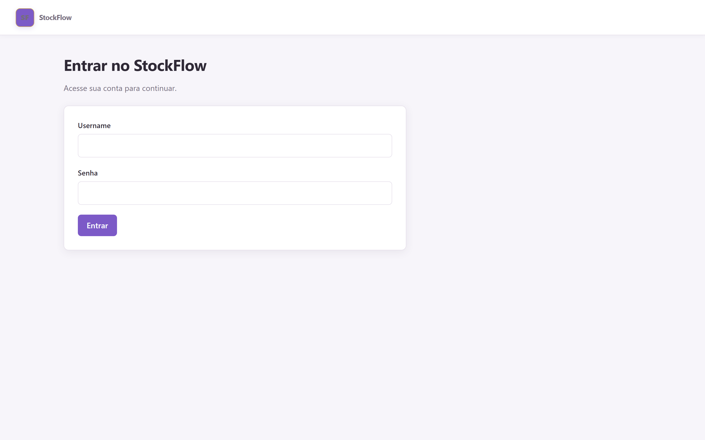
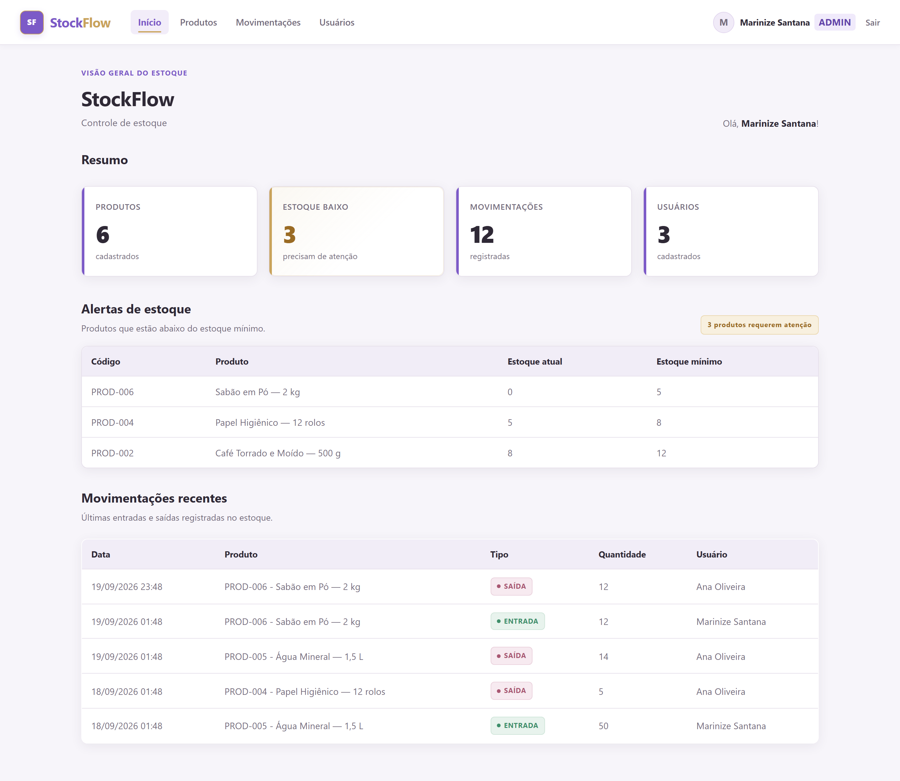
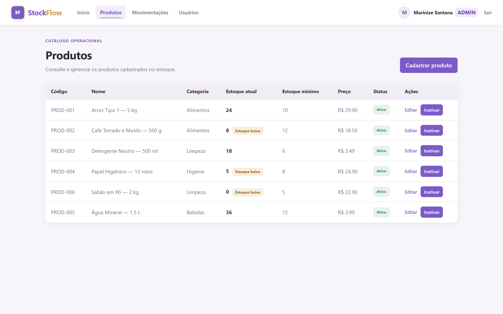
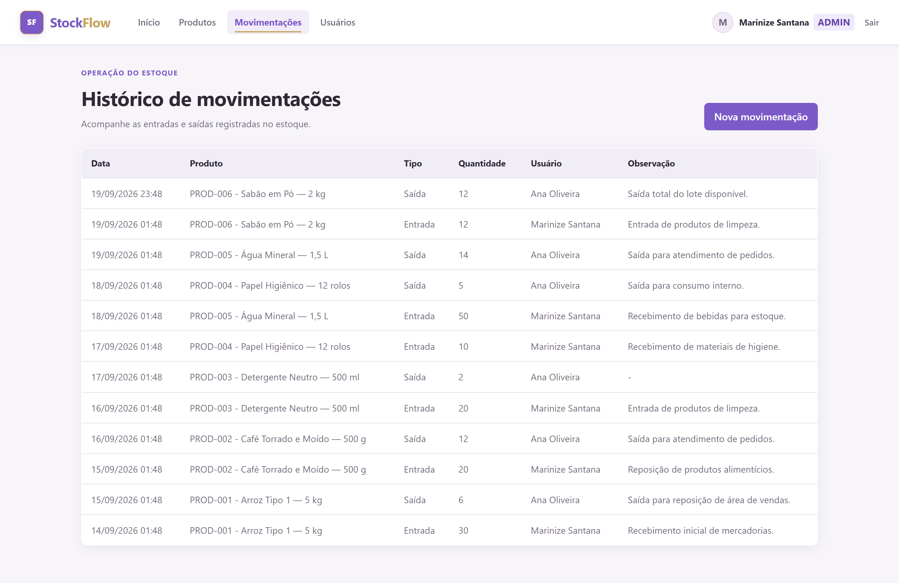

# StockFlow

[](https://github.com/marinizedev/stockflow-inventory-system/actions/workflows/ci.yml)
[](https://github.com/marinizedev/stockflow-inventory-system/actions/workflows/security.yml)
[](https://github.com/marinizedev/stockflow-inventory-system/actions/workflows/cd.yml)

**Sistema web de controle de estoque desenvolvido com Python e Flask.**

O StockFlow permite cadastrar produtos, registrar entradas e saídas, acompanhar os níveis de estoque, identificar itens abaixo do mínimo definido e consultar o histórico das movimentações. A aplicação conta com autenticação, autorização por perfil, proteção CSRF, validações de regras de negócio, atualização atômica do saldo e testes automatizados.

Iniciado como projeto acadêmico com Flask e SQLite, o StockFlow evoluiu para uma aplicação publicada na nuvem, utilizando PostgreSQL no Neon, Gunicorn, Render e automações de CI/CD com GitHub Actions.

**Aplicação publicada:** [Acessar o StockFlow](https://stockflow-inventory-system-zaqc.onrender.com)

## Índice

- [Demonstração](#demonstra%C3%A7%C3%A3o)

- [Sobre o projeto](#sobre-o-projeto)

- [Objetivo](#objetivo)

- [Funcionalidades](#funcionalidades)

- [Perfis de acesso](#perfis-de-acesso)

- [Regras de negócio](#regras-de-neg%C3%B3cio)

- [Arquitetura](#arquitetura)

- [Modelo de dados](#modelo-de-dados)

- [Segurança e integridade](#seguran%C3%A7a-e-integridade)

- [Testes automatizados](#testes-automatizados)

- [CI/CD](#cicd)

- [Tecnologias](#tecnologias)

- [Estrutura do projeto](#estrutura-do-projeto)

- [Executar localmente](#executar-localmente)

- [Configuração por ambiente](#configura%C3%A7%C3%A3o-por-ambiente)

- [Deploy e infraestrutura](#deploy-e-infraestrutura)

- [Decisões técnicas](#decis%C3%B5es-t%C3%A9cnicas)

- [Evolução do projeto](#evolu%C3%A7%C3%A3o-do-projeto)

- [Possíveis evoluções](#poss%C3%ADveis-evolu%C3%A7%C3%B5es)

- [Autoria](#autoria)

- [Referências](#refer%C3%AAncias)

- [Licença](#licen%C3%A7a)

---

## Demonstração

**Aplicação publicada:** [https://stockflow-inventory-system-zaqc.onrender.com](https://stockflow-inventory-system-zaqc.onrender.com)

O ambiente público permite conhecer as principais funcionalidades por meio de uma conta de demonstração com permissões exclusivamente de leitura.

> **Disponibilidade:** por utilizar o plano gratuito do Render, a aplicação pode levar alguns segundos para responder após períodos de inatividade.

### Acesso de demonstração

| Campo | Valor |
| --- | --- |
| Usuário | `visitante.demo` |
| Senha | `StockFlowDemo2026!` |
| Perfil | `DEMO` |
| Permissões | Consulta ao dashboard, produtos e movimentações |

A credencial é pública e exclusiva para demonstração do StockFlow. Não deve ser reutilizada em outros serviços ou projetos.

O perfil `DEMO` não pode criar, editar ou inativar usuários e produtos, nem registrar movimentações. As restrições são aplicadas no backend.

### Demonstração visual

As imagens apresentam as principais telas da aplicação. Elas podem ter sido capturadas em ambiente local, com dados fictícios, e não representam necessariamente a sessão ou as permissões da conta pública `DEMO`.

#### Login



#### Dashboard



#### Catálogo de produtos



#### Histórico de movimentações



---

## Sobre o projeto

O StockFlow é uma aplicação web destinada ao controle de produtos e movimentações de estoque. Seu objetivo é centralizar as informações operacionais, manter o histórico das operações e reduzir inconsistências no registro das quantidades disponíveis.

O projeto foi estruturado com separação entre rotas, serviços e modelos. Essa organização permite concentrar as regras de negócio em uma camada específica, facilitando a manutenção, os testes e a evolução da aplicação.

## Objetivo

O StockFlow tem como objetivo centralizar o controle de produtos, estoques e movimentações em uma aplicação web segura e organizada. A solução busca preservar o histórico das operações, impedir inconsistências como saldo negativo, identificar produtos abaixo do estoque mínimo e aplicar permissões conforme o perfil de cada usuário.

## Funcionalidades

### Autenticação e gerenciamento de sessão

- Login e logout.

- Logout realizado por `POST`, com token CSRF.

- Verificação do status do usuário a cada requisição autenticada.

- Encerramento da sessão quando o usuário deixa de existir ou é inativado.

- Senhas armazenadas como hash utilizando Werkzeug.

- Controle de sessão e proteção de páginas restritas.

- Redirecionamento de usuários não autenticados.

- Bloqueio de login para usuários inativos.

- Cookies de sessão com `SameSite=Lax` e flag `Secure` no ambiente publicado.

### Gerenciamento de usuários

Funcionalidades administrativas disponíveis para o perfil `ADMIN`:

- Cadastro e edição de usuários.

- Alteração de nome, username e perfil.

- Perfis `ADMIN`, `COMUM` e `DEMO`.

- Ativação e inativação lógica.

- Proteção contra a inativação do último administrador ativo.

- Impedimento de auto-inativação.

- Regras para impedir o rebaixamento indevido de administradores.

### Gerenciamento de produtos

- Cadastro, edição, ativação e inativação restritos ao perfil `ADMIN`.

- Consulta do catálogo disponível a usuários autenticados.

- Código único por produto.

- Nome, categoria, descrição opcional e preço.

- Definição do estoque mínimo.

- Ativação e inativação lógica.

- Validação de valores não negativos.

- Preservação do saldo durante a edição cadastral.

No cadastro, `quantidade_inicial` define o saldo de abertura do produto no sistema e não gera uma movimentação no histórico. Após a criação do produto, as alterações de estoque ocorrem exclusivamente por movimentações `ENTRADA` e `SAIDA`. A edição cadastral não pode alterar o estoque atual.

### Movimentações de estoque

- Registro de entradas e saídas pelos perfis `ADMIN` e `COMUM`.

- Associação da movimentação ao produto e ao usuário responsável.

- Registro de quantidade, data e observação.

- Atualização atômica do saldo no banco, com `UPDATE` condicional.

- Persistência do saldo e da movimentação na mesma transação.

- Bloqueio de movimentações para produtos inativos.

- Validação de quantidades.

- Prevenção de saídas superiores ao saldo vigente no banco.

- Consulta ao histórico de movimentações.

- Bloqueio de operações de escrita para o perfil `DEMO`.

### Dashboard

- Total de produtos cadastrados.

- Alertas de estoque mínimo restritos a produtos ativos.

- Total de movimentações.

- Total de usuários.

- Exibição das movimentações mais recentes.

### Interface

- Layout responsivo com identidade visual própria.

- Página `403` para acessos sem permissão.

- Formulários de escrita com token CSRF.

- Ocultação de ações na interface conforme o perfil, complementar à autorização no backend.

---

## Perfis de acesso

| Perfil | Permissões |
| --- | --- |
| `ADMIN` | Gerencia usuários e produtos e realiza movimentações de estoque. |
| `COMUM` | Consulta produtos e realiza movimentações de estoque, sem acesso ao gerenciamento de usuários. |
| `DEMO` | Consulta o dashboard, os produtos e o histórico de movimentações, sem permissão para alterar os dados. |

A autorização é verificada no backend. A ocultação de botões na interface não é utilizada como único mecanismo de controle de acesso.

---

## Regras de negócio

O StockFlow implementa regras para manter a consistência das operações e proteger o histórico do estoque.

1. Nome, username e senha são obrigatórios no cadastro de usuários.

2. O username deve ser único.

3. As senhas não são armazenadas em texto puro.

4. O perfil deve corresponder a um dos perfis permitidos.

5. Somente usuários `ADMIN` podem gerenciar usuários e o cadastro de produtos.

6. Usuários inativos não podem realizar login.

7. Deve existir pelo menos um administrador ativo.

8. O último administrador ativo não pode ser inativado.

9. Um usuário não pode inativar a própria conta.

10. O rebaixamento de um administrador depende da existência de outro administrador ativo.

11. O perfil `DEMO` não pode realizar operações de escrita.

12. O código do produto deve ser único.

13. O estoque atual não pode ser alterado diretamente na edição cadastral.

14. Quantidade em estoque e estoque mínimo não podem ser negativos.

15. O preço não pode ser negativo.

16. A quantidade de uma movimentação deve ser maior que zero.

17. Produtos inativos não podem receber movimentações.

18. Uma saída não pode gerar estoque negativo.

19. A validação de saída considera o saldo vigente no banco, e não apenas o valor carregado em memória.

20. A atualização do produto e o registro da movimentação ocorrem na mesma transação.

21. Toda movimentação deve estar relacionada a um produto e a um usuário.

22. O tipo de movimentação deve ser `ENTRADA` ou `SAIDA`.

23. Produtos ativos com saldo inferior ao estoque mínimo são identificados nos alertas.

24. Usuários e produtos são inativados logicamente, preservando seus registros e relacionamentos históricos.

25. Operações de escrita exigem token CSRF válido.

---

## Arquitetura

A aplicação utiliza uma arquitetura organizada em camadas, separando o tratamento das requisições das regras de negócio e da persistência.

```text
Navegador
    |
    v
Routes
    |
    v
Services
Regras de negócio e validações
    |
    v
Models
Entidades e mapeamento ORM
    |
    v
Banco de dados
SQLite / PostgreSQL
```

### Responsabilidades

- **Routes:** recebem requisições, aplicam autenticação e CSRF e controlam o fluxo de navegação.

- **Services:** concentram regras de negócio, validações e operações do domínio.

- **Models:** representam as entidades e seus relacionamentos por meio do SQLAlchemy.

- **Auth:** revalida a sessão e aplica os decoradores `login_required`, `escrita_required` e `admin_required`.

- **Templates:** renderizam as páginas HTML utilizando Jinja2.

- **Static:** reúne os recursos estáticos, incluindo os estilos CSS.

- **Logging:** registra eventos operacionais e falhas de persistência em stdout.

- **Banco de dados:** armazena usuários, produtos e movimentações.

---

## Modelo de dados

O sistema utiliza três entidades principais.

### `usuarios`

Armazena os dados de identificação, o hash da senha, o perfil de acesso, o status da conta e a data de criação.

### `produtos`

Armazena o código, o nome, a descrição, a categoria, o preço, o saldo atual, o estoque mínimo, o status e a data de criação.

### `movimentacoes`

Armazena o produto relacionado, o usuário responsável, o tipo da operação, a quantidade, a observação e a data da movimentação.

### Relacionamentos

```text
Usuario 1 ───── N Movimentacao N ───── 1 Produto
```

Um usuário pode realizar várias movimentações, e um produto pode possuir várias movimentações registradas.

As chaves estrangeiras estabelecem os relacionamentos entre as entidades e contribuem para a integridade referencial. Os campos `username` e `codigo` são únicos.

O arquivo `database/schema.sql` funciona como uma referência SQL versionada da estrutura do banco, incluindo constraints e índices auxiliares. A inicialização atual da aplicação utiliza `db.create_all()` a partir dos modelos SQLAlchemy; portanto, o arquivo SQL não é aplicado automaticamente. Alterações estruturais em bancos existentes devem ser realizadas por migração ou por comandos SQL controlados. No SQLite, as chaves estrangeiras são ativadas na conexão da aplicação.

---

## Segurança e integridade

A aplicação adota mecanismos de segurança e validação em diferentes camadas:

- **Hash de senhas:** utilização das funções de segurança do Werkzeug.

- **Chave de sessão:** configuração por meio da variável de ambiente `STOCKFLOW_SECRET_KEY`, sem fallback para uma chave padrão no código.

- **Configuração externa:** credenciais e configurações sensíveis não devem ser armazenadas no repositório.

- **CSRF:** proteção global com Flask-WTF; formulários de escrita e o logout enviam `csrf_token`.

- **Cookies de sessão:** `SESSION_COOKIE_SAMESITE=Lax`. `SESSION_COOKIE_SECURE` é ativado no Render, ou quando a variável de mesmo nome é definida como `true`.

- **Autorização no backend:** validação das permissões antes de executar operações restritas. Acessos indevidos recebem HTTP 403.

- **Controle de sessão:** proteção das áreas destinadas a usuários autenticados e invalidação de sessões de contas inexistentes ou inativas.

- **Perfil DEMO:** bloqueio de operações de escrita, inclusive quando o token CSRF é válido.

- **Validação de negócio:** verificação dos dados antes de executar as operações.

- **Consistência de estoque:** `UPDATE` atômico do saldo, com condição `quantidade_atual >= quantidade` nas saídas, em transação única com o registro da movimentação.

- **Integridade referencial:** chaves estrangeiras nos modelos; no SQLite, `PRAGMA foreign_keys = ON` na conexão.

- **Inativação lógica:** preservação dos registros necessários ao histórico.

- **Servidor local:** `run.py` inicia a aplicação com `debug=False`.

- **Análise estática:** Bandit sobre o pacote `app`.

- **Auditoria de dependências:** utilização do pip-audit para verificar vulnerabilidades conhecidas nas dependências Python.

A configuração da chave de sessão é obrigatória em todos os ambientes nos quais a aplicação é iniciada. No ambiente publicado, o valor deve ser fornecido pelas variáveis de ambiente do Render.

---

## Testes automatizados

O projeto utiliza **pytest** para verificar regras de negócio e proteções da camada HTTP.

A suíte possui **58 casos executados**, distribuídos em 57 funções de teste e um caso parametrizado para dois perfis de acesso:

```powershell
58 passed
```

A cobertura funcional inclui:

- Autenticação e hash de senha.

- Permissões por perfil, incluindo `DEMO`.

- Restrições de usuários e administradores.

- Cadastro, edição, ativação e inativação de produtos.

- Validação de valores.

- Entradas e saídas de estoque.

- Atualização atômica do saldo vigente no banco.

- Rejeição de saídas com objeto de produto obsoleto em memória.

- Rollback conjunto do saldo e da movimentação em falha de persistência.

- Prevenção de estoque negativo.

- Regras relacionadas a produtos inativos.

- Rejeição de `POST` sem token CSRF ou com token inválido.

- Logout por `POST` com CSRF.

- Autorização HTTP complementar aos testes de serviço.

Os testes utilizam um banco SQLite em memória, isolando suas operações dos dados da instalação local e do banco de produção. A configuração em `pytest.ini` inclui a raiz do projeto no `pythonpath`.

A inicialização da aplicação exige `STOCKFLOW_SECRET_KEY`. O workflow de CI define essa variável no job; em execução local, ela deve estar disponível no ambiente.

Para executar os testes:

```bash
pytest -v
```

---

## CI/CD

O repositório utiliza GitHub Actions para automatizar testes, verificações de segurança e validação da disponibilidade da aplicação após a publicação.

| Workflow | Responsabilidade |
| --- | --- |
| **CI** | Executa verificações de compilação, integridade do diff e testes automatizados em pushes para `main` e pull requests direcionados à `main`. |
| **Security** | Executa verificações de segurança, análise estática com `Bandit` e auditoria de dependências com `pip-audit` em pushes para `main`, pull requests direcionados à `main` e execuções manuais. |
| **CD** | Após pushes para `main`, aguarda o deploy no Render e verifica por HTTP se a aplicação publicada está disponível e respondendo corretamente. |

### Fluxo de publicação

```text
Pull Request
     |
     +------------------+
     |                  |
     v                  v
    CI              Security
     |                  |
     +--------+---------+
              |
              v
       Merge na branch main
              |
              v
     Deploy automático
         no Render
              |
              v
       Verificação HTTP
         pós-deploy
```

O smoke test verifica a disponibilidade da rota pública `/login`. Essa verificação confirma a resposta HTTP da rota, mas não substitui testes completos de todas as funcionalidades da aplicação, não realiza autenticação e não executa operações de escrita no ambiente público.

---

## Tecnologias

| Tecnologia | Utilização |
| --- | --- |
| Python | Linguagem de programação. |
| Flask | Framework web. |
| Flask-WTF | Proteção CSRF nos formulários. |
| Flask-SQLAlchemy | Integração entre Flask e SQLAlchemy. |
| SQLAlchemy | ORM e mapeamento das entidades. |
| SQLite | Banco de dados local e ambiente de testes. |
| PostgreSQL | Banco de dados do ambiente publicado. |
| Neon | Serviço gerenciado de PostgreSQL. |
| Psycopg | Driver de conexão com PostgreSQL. |
| Gunicorn | Servidor WSGI utilizado na publicação. |
| Jinja2 | Renderização de templates. |
| HTML5 e CSS3 | Estrutura e apresentação da interface. |
| Werkzeug | Recursos de segurança, incluindo hash de senhas. |
| Python logging | Logging operacional estruturado em stdout. |
| pytest | Testes automatizados. |
| GitHub Actions | Automação de CI/CD e verificações. |
| Render | Hospedagem da aplicação. |
| Bandit | Análise estática de segurança no CI. |
| pip-audit | Auditoria de dependências Python. |

---

## Estrutura do projeto

```bash
stockflow/
├── app/
│   ├── auth/
│   │   └── decorators.py
│   ├── models/
│   │   ├── movimentacao.py
│   │   ├── produto.py
│   │   └── usuario.py
│   ├── routes/
│   │   ├── auth.py
│   │   ├── dashboard.py
│   │   ├── movimentacoes.py
│   │   ├── produtos.py
│   │   └── usuarios.py
│   ├── services/
│   │   ├── movimentacao_service.py
│   │   ├── produto_service.py
│   │   └── usuario_service.py
│   ├── static/
│   │   └── css/
│   │       └── style.css
│   ├── templates/
│   │   ├── movimentacoes/
│   │   │   ├── index.html
│   │   │   └── nova.html
│   │   ├── produtos/
│   │   │   ├── editar.html
│   │   │   ├── index.html
│   │   │   └── novo.html
│   │   ├── usuarios/
│   │   │   ├── editar.html
│   │   │   ├── index.html
│   │   │   └── novo.html
│   │   ├── 403.html
│   │   ├── base.html
│   │   ├── dashboard.html
│   │   └── login.html
│   ├── __init__.py
│   └── logging_config.py
│
├── database/
│   └── schema.sql
├── docs/
│   └── images/
│       ├── dashboard.png
│       ├── login.png
│       ├── movimentacoes.png
│       └── produtos.png
├── tests/
│   ├── conftest.py
│   ├── test_csrf_protection.py
│   ├── test_movimentacao_service.py
│   ├── test_produto_service.py
│   └── test_usuario_service.py
├── .github/
│   └── workflows/
│       ├── ci.yml
│       ├── security.yml
│       └── cd.yml
├── .env.example
├── .gitattributes
├── .gitignore
├── config.py
├── create_admin.py
├── init_db.py
├── LICENSE
├── pytest.ini
├── requirements-production.txt
├── requirements.txt
├── run.py
└── README.md
```

---

## Executar localmente

### Requisitos

- Python 3.12 ou superior.

- Git.

- PowerShell no Windows ou um terminal compatível.

### 1. Clonar o repositório

```bash
git clone https://github.com/marinizedev/stockflow-inventory-system.git
cd stockflow-inventory-system
```

### 2. Criar e ativar o ambiente virtual

```bash
python -m venv .venv
```

No Windows PowerShell:

```bash
.\.venv\Scripts\Activate.ps1
```

### 3. Instalar as dependências

```bash
python -m pip install -r requirements.txt
```

### 4. Configurar a chave de sessão

A aplicação exige a variável `STOCKFLOW_SECRET_KEY`. Para gerar uma chave aleatória no PowerShell:

```bash
python -c "import secrets; print(secrets.token_hex(32 ))"
```

Copie o valor gerado e defina-o na sessão atual do terminal:

```bash
$env:STOCKFLOW_SECRET_KEY = "COLE_A_CHAVE_GERADA_AQUI"
```

Use uma chave própria para o ambiente local. Não utilize a chave de produção nem compartilhe o valor gerado.

Essa variável definida no PowerShell permanece disponível somente naquela sessão. Se abrir outro terminal, será necessário configurá-la novamente, salvo se você adotar outro mecanismo local de configuração. Os testes e o `create_app()` também exigem essa variável.

### 5. Inicializar o banco e criar o administrador

```bash
python init_db.py
python create_admin.py
```

O banco SQLite local é independente e inicialmente vazio. O script `init_db.py` cria as tabelas a partir dos modelos. O script `create_admin.py` solicita os dados necessários para criar a conta administrativa inicial.

### 6. Iniciar a aplicação

```bash
python run.py
```

Acesse:

```bash
http://127.0.0.1:5000
```

### Banco de dados local

Na ausência de `DATABASE_URL`, a aplicação utiliza o SQLite configurado para o ambiente local.

Cada instalação possui seus próprios usuários, produtos e movimentações. O repositório contém o código e os arquivos de estrutura necessários, mas não versiona os dados operacionais das instalações.

### Executar os testes

```bash
pytest -v
```

---

## Configuração por ambiente

O StockFlow seleciona o banco de dados de acordo com a variável `DATABASE_URL`.

| Configuração | Comportamento |
| --- | --- |
| `DATABASE_URL` ausente | Utiliza SQLite local. |
| `DATABASE_URL` definida | Utiliza o banco indicado pela URL. URLs `postgres://` e `postgresql://` são convertidas para o dialecto `postgresql+psycopg://`. |
| `STOCKFLOW_SECRET_KEY` ausente | Impede a inicialização da aplicação. |
| `STOCKFLOW_SECRET_KEY` definida | Fornece a chave utilizada pelo Flask para assinar a sessão. |
| `LOG_LEVEL` ausente | Utiliza `INFO` como nível de log. |
| `SESSION_COOKIE_SECURE` | Quando `true`, marca o cookie de sessão como `Secure`. |
| `RENDER=true` | Ativa `SESSION_COOKIE_SECURE` caso `SESSION_COOKIE_SECURE` não tenha sido definida. |

```bash
DATABASE_URL=
STOCKFLOW_SECRET_KEY=
LOG_LEVEL=INFO
SESSION_COOKIE_SECURE=
```

O arquivo `.env.example` documenta as variáveis esperadas. As variáveis podem ser fornecidas pelo ambiente de execução ou por um mecanismo de carregamento de variáveis configurado localmente. Valores sensíveis não devem ser versionados no repositório.

A URL do banco e a chave de sessão não devem ser incluídas no código-fonte, no README ou em capturas de tela públicas.

---

## Deploy e infraestrutura

### Render

A aplicação publicada utiliza o Render para hospedar o serviço web.

Configuração informada para o serviço:

| Campo | Valor |
| --- | --- |
| Branch | `main` |
| Build Command | `pip install -r requirements-production.txt` |
| Start Command | `gunicorn run:app` |
| Runtime | Python 3 |

As variáveis de ambiente são configuradas no painel do serviço.

### Neon

O banco de produção utiliza PostgreSQL gerenciado no Neon.

A connection string é fornecida ao Render por meio de `DATABASE_URL`. Dessa forma, as credenciais do banco permanecem fora do repositório.

O SQLite continua sendo utilizado no desenvolvimento local e nos testes, sem exigir uma instalação local de PostgreSQL.

---

## Decisões técnicas

### Separação entre rotas e serviços

A separação das responsabilidades evita concentrar todas as regras nas rotas. Os serviços são responsáveis pelas regras de negócio, enquanto as rotas coordenam as requisições e respostas HTTP.

### Estoque controlado por movimentações

`quantidade_inicial` representa o saldo de abertura do produto no sistema; esse saldo inicial não é uma movimentação e não cria um registro no histórico. Depois que o produto é criado, o saldo só pode ser alterado por entradas (`ENTRADA` ) e saídas (`SAIDA`) válidas. A edição cadastral não permite alterar diretamente a quantidade em estoque.

A atualização do saldo não utiliza o valor em memória do objeto carregado pela rota. O serviço emite um `UPDATE` atômico (`quantidade_atual = quantidade_atual ± quantidade`). Nas saídas, a cláusula `WHERE` exige produto ativo e saldo suficiente. Se nenhuma linha for afetada, a operação é revertida. O insert da movimentação e o `commit` ocorrem na mesma transação.

### Inativação lógica

Usuários e produtos são inativados em vez de excluídos fisicamente. Essa decisão preserva registros e relacionamentos necessários ao histórico das movimentações.

### Perfil público de demonstração

O perfil `DEMO` permite apresentar o sistema sem conceder permissões de alteração sobre os dados compartilhados. As restrições são aplicadas no backend.

### Configuração por ambiente

O SQLite é utilizado no desenvolvimento local e o PostgreSQL no ambiente publicado. A seleção do banco ocorre por meio de `DATABASE_URL`, enquanto a chave de sessão é fornecida separadamente por `STOCKFLOW_SECRET_KEY`.

### Proteção CSRF e cookies

A proteção CSRF é global. O logout deixou de ser um `GET` e passou a ser um `POST` autenticado com token. Os cookies de sessão usam `SameSite=Lax`; em HTTPS no Render, também usam `Secure`.

---

## Evolução do projeto

O StockFlow começou como uma atividade acadêmica e foi ampliado progressivamente para incorporar práticas de organização de software, segurança e publicação.

### Etapa acadêmica

- Desenvolvimento da aplicação com Flask.

- Persistência em SQLite.

- Autenticação e perfis `ADMIN` e `COMUM`.

- Cadastro e gerenciamento de produtos.

- Movimentações de entrada e saída.

- Controle de estoque mínimo.

- Histórico das operações.

- Testes automatizados.

### Evolução posterior

1. Organização da aplicação em rotas, serviços e modelos.

2. Ampliação das regras de autenticação e autorização.

3. Testes automatizados para as regras de negócio.

4. Implementação de logging operacional em stdout, com nível configurável.

5. CI e auditoria de dependências.

6. Integração com PostgreSQL no Neon.

7. Publicação com Gunicorn no Render.

8. Pipeline de CD com verificação HTTP pós-deploy.

9. Criação de um perfil público `DEMO` somente para leitura.

10. Documentação visual e técnica no repositório.

11. Proteção CSRF com Flask-WTF e logout por `POST`.

12. Revalidação de sessão para usuários inativos ou inexistentes.

13. Atualização atômica do estoque e transação única com a movimentação.

14. Testes HTTP de CSRF, autorização e consistência do saldo.

15. Cookies de sessão com `SameSite` e `Secure` no ambiente publicado.

16. Interface revisada, página 403 e layout responsivo.

Essa evolução permitiu levar uma aplicação inicialmente acadêmica a um ambiente público, mantendo o foco no controle de estoque, na integridade dos dados e na rastreabilidade das operações.

---

## Possíveis evoluções

As funcionalidades abaixo são possibilidades futuras e não fazem parte do escopo funcional descrito nesta versão:

- Relatórios gerenciais de estoque.

- Indicadores históricos e análise de movimentações.

- Gestão de múltiplos depósitos.

- Leitura de códigos de barras.

- Regras de reposição automática.

- Integrações com outros sistemas.

- Adoção de uma ferramenta de migração, como Alembic ou Flask-Migrate, para versionar alterações estruturais do banco e aplicar constraints de forma controlada em ambientes existentes.

- Fixação e atualização controlada de todas as versões das dependências de produção.

---

## Autoria

Projeto desenvolvido por **Marinize Santana**.

- **GitHub:** [marinizedev](https://github.com/marinizedev)

- **LinkedIn:** [Marinize Santana](https://linkedin.com/in/marinize-santana-47bb2b372)

- **E-mail:** [marinize.santana.dev@gmail.com](mailto:marinize.santana.dev@gmail.com)

---

## Referências

- [Flask Documentation](https://flask.palletsprojects.com/)

- [Flask-WTF — CSRF Protection](https://flask-wtf.readthedocs.io/en/stable/csrf.html)

- [Render — Deploy a Flask App](https://render.com/docs/deploy-flask)

- [Render — Environment Variables](https://render.com/docs/configure-environment-variables)

- [Neon Documentation](https://neon.com/docs/)

- [pytest Documentation](https://docs.pytest.org/)

- [GitHub Actions Documentation](https://docs.github.com/en/actions)

- [Gunicorn Documentation](https://gunicorn.org/)

- [Werkzeug — Security Utilities](https://werkzeug.palletsprojects.com/en/stable/utils/)

- [SQLAlchemy Documentation](https://docs.sqlalchemy.org/)

- [SQLite Documentation](https://sqlite.org/docs.html)

- [PostgreSQL Documentation](https://www.postgresql.org/docs/)

- [Bandit Documentation](https://bandit.readthedocs.io/)

---

## Licença

Este projeto está disponibilizado sob a licença MIT. Consulte o arquivo [LICENSE](LICENSE) para conhecer os termos de utilização e reutilização do código.
